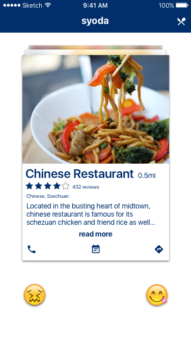
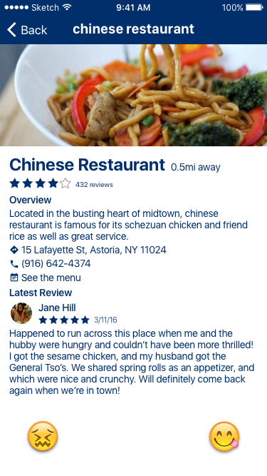
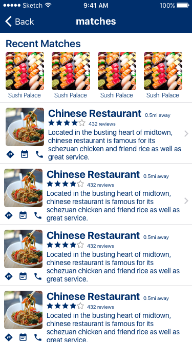

# Syoda
CodePath Group Project

Tinder for food, get an instant feed of restaurants near you when you're hungry or looking for something new!

## APIs
We will be using the Yelp Search API to find local restaurants around you, and to allow users to enter parameters into what they want to eat.

## Models
Business Class
- id
- name
- address
- website
- rating
- ratingsCount
- latestReview
- headerPicture
- snippetText

Review
- rating
- user
- excerpt
- time

User
- username
- picture

## User Stories

- [ ] Users can setup their search preferences (distance, cuisine, etc)
- [ ] Users can swipe right to like a restaurant
- [ ] Users can swipe left to dislike restaurant
- [ ] Users can tap on restaurant to get more information

## Optional Features
- [ ] Users can go to restaurants menu, website and other info from profile
- [ ] Users can receive food suggestions based on previous likes and dislikes

## Wireframes

## License

    Copyright [2016] [Aditya Balwani, Harpreet Singh, Philippe Kimura-Thollander]

    Licensed under the Apache License, Version 2.0 (the "License");
    you may not use this file except in compliance with the License.
    You may obtain a copy of the License at

        http://www.apache.org/licenses/LICENSE-2.0

    Unless required by applicable law or agreed to in writing, software
    distributed under the License is distributed on an "AS IS" BASIS,
    WITHOUT WARRANTIES OR CONDITIONS OF ANY KIND, either express or implied.
    See the License for the specific language governing permissions and
    limitations under the License.
